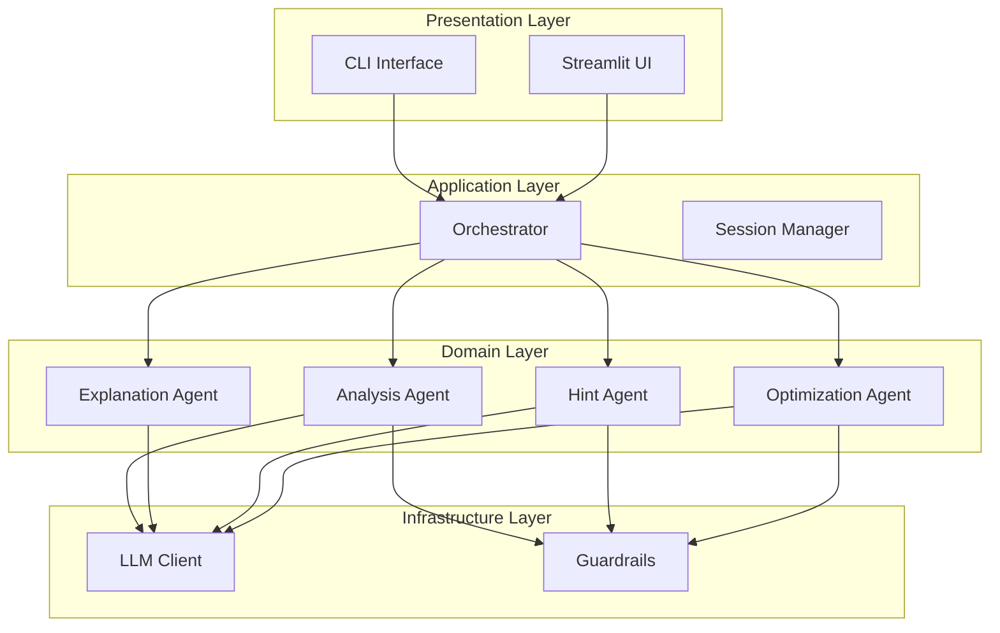
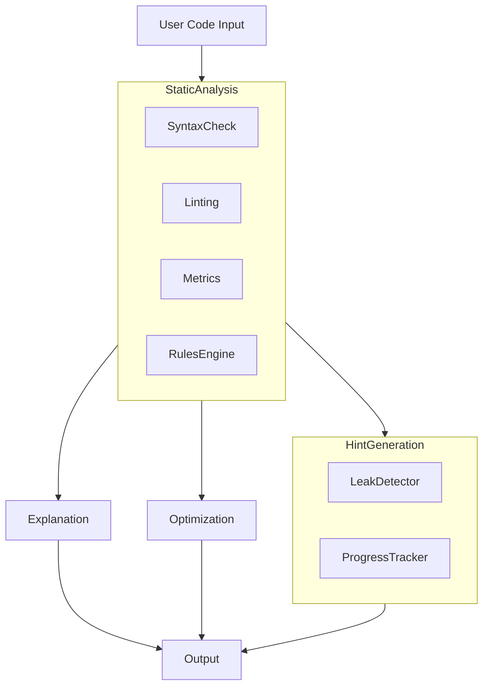

# Technical Architecture

## Overview

This document describes the technical architecture of the AI Bug & Debugging Advisor system, detailing the design patterns, technologies, and implementation approaches used to create an effective code analysis and debugging assistant.

## System Design Principles

### 1. Separation of Concerns
The system follows a strict separation of concerns with distinct layers:

- **Presentation Layer**: User interface (CLI, Streamlit)
- **Application Layer**: Business logic and workflows
- **Domain Layer**: Core entities and rules
- **Infrastructure Layer**: External integrations and services

### 2. Single Responsibility Principle
Each class and module has a single, well-defined responsibility:

- Agents handle specific aspects of the debugging pipeline
- Guardrails ensure system safety and security
- Orchestrators coordinate complex workflows
- Sessions manage persistent state

### 3. Open/Closed Principle
The system is designed to be open for extension but closed for modification:

- Plugin-like architecture for new analysis rules
- Strategy pattern for different LLM implementations
- Template-based prompts for consistent interactions

## Component Architecture

### Core Processing Pipeline

The system operates through a well-defined processing pipeline with four main stages:

#### Stage 1: Static Analysis
```python
# src/debug_advisor/agents/analysis/
├── syntax.py           # AST-based syntax validation
├── linters.py          # Integration with external linters
├── metrics.py          # Code complexity and metrics
├── rules/              # Analysis rule engine
│   ├── base.py         # Rule base classes
│   ├── logic.py        # Logic error rules
│   ├── structural.py   # Structural rules
│   └── style.py        # Style rules
└── registry.py         # Rules coordination
```

**Responsibilities:**
- Detect syntax errors using Python's `ast.parse()`
- Identify code quality issues using Ruff/Pyflakes
- Calculate complexity metrics with Radon
- Apply business logic rules for specific bug patterns

#### Stage 2: Explanation Generation
```python
# src/debug_advisor/agents/explanation.py
```

**Responsibilities:**
- Convert technical findings to human-readable format
- Generate contextual explanations based on detected issues
- Maintain consistency in explanation style and tone
- Use LLM templates for natural language generation

#### Stage 3: Hint Generation
```python
# src/debug_advisor/agents/hints.py
```

**Responsibilities:**
- Create five-level hint system (progressive disclosure)
- Ensure no hint leaks the complete solution
- Track hint progress across sessions
- Provide educational guidance without revealing answers

#### Stage 4: Optimization
```python
# src/debug_advisor/agents/optimization.py
```

**Responsibilities:**
- Generate corrected code versions
- Apply optimization patterns
- Provide implementation suggestions
- Maintain code quality standards

### Supporting Components

#### LLM Integration Layer
```python
# src/debug_advisor/llm/
├── base.py             # Abstract LLM client interface
├── copilot_client.py   # GitHub Copilot implementation
└── stub_client.py      # Offline testing implementation
```

**Design Patterns:**
- **Strategy Pattern**: Different LLM providers as interchangeable strategies
- **Template Method**: Common LLM interaction flow with provider-specific implementations

#### Session Management
```python
# src/debug_advisor/session.py
```

**Responsibilities:**
- Track hint levels per session
- Persist user progress
- Manage state across interactions
- Support concurrent sessions

#### Guardrails and Validation
```python
# src/debug_advisor/guardrails/
├── leak_detector.py    # Prevent hint leakage
└── output_validator.py # Validate LLM outputs
```

**Responsibilities:**
- Security validation of generated content
- Schema validation for structured outputs
- Prevention of information disclosure

### Orchestration and Coordination
```python
# src/debug_advisor/orchestrator.py
```

**Responsibilities:**
- Coordinate the entire processing pipeline
- Manage error handling and recovery
- Handle edge cases and retries
- Provide metrics and monitoring

## Technology Choices

### 1. Python Ecosystem
**Rationale:** Python provides excellent tooling for code analysis and rapid prototyping.

#### Dependencies:
- **typer**: Modern CLI framework with rich help system
- **rich**: Advanced terminal formatting and user experience
- **jinja2**: Flexible templating for LLM prompts
- **python-dotenv**: Environment variable management
- **ruff**: Fast Python linter and formatter
- **radon**: Code complexity analysis
- **pyflakes**: Code validation

### 2. Static Analysis Tools
**Rationale:** Multiple complementary tools provide comprehensive coverage.

- **AST (Abstract Syntax Tree)**: Standard Python for code structure analysis
- **Ruff**: Fast, modern linter with extensive rule set
- **Radon**: Cyclomatic complexity and maintainability metrics
- **Pyflakes**: Simple code validation without runtime dependencies

### 3. LLM Integration
**Rationale:** Flexibility to work with different LLM providers.

- **GitHub Copilot API**: Production-grade LLM integration
- **Custom Stub Client**: Deterministic offline behavior for testing

### 4. Template System
**Rationale:** Consistency and version control for LLM interactions.

- **Jinja2**: Powerful templating engine
- **Versioned Templates**: Template evolution and A/B testing

## Data Flow Architecture

### Normal Processing Flow

1. **Input**: User provides code snippet
2. **Analysis**: Static analysis detects issues
3. **Explanation**: Generate human-readable descriptions
4. **Hints**: Create progressive hint levels
5. **Optimization**: Generate corrected versions
6. **Output**: Return structured results to user

### Error Handling Flow

1. **Input Validation**: Validate code syntax before processing
2. **Graceful Degradation**: Fallback behavior for incomplete analysis
3. **Error Recovery**: Retry mechanisms for transient failures
4. **User Feedback**: Clear error messages and recovery suggestions

## Performance Considerations

### 1. Caching Strategy
- **Hint Level Caching**: Prevent redundant hint generation
- **Analysis Caching**: Cache expensive operations like complexity calculation
- **Template Caching**: Pre-compile Jinja2 templates

### 2. Memory Management
- **Lazy Loading**: Load only necessary components
- **Streaming Processing**: Handle large code files efficiently
- **Resource Monitoring**: Track and limit resource usage

### 3. Scalability
- **Parallel Processing**: Independent analysis tasks can run in parallel
- **Batch Processing**: Support for processing multiple files
- **Distributed Processing**: Foundation for horizontal scaling

## Security Architecture

### 1. Defense in Depth
- **Input Validation**: Sanitize and validate all user inputs
- **Output Sanitization**: Filter potentially harmful content
- **Access Controls**: Environment-based configuration
- **Audit Logging**: Track all system interactions

### 2. Information Leakage Prevention
- **Hint Validation**: Ensure hints don't reveal solutions
- **Content Filtering**: Remove sensitive information from outputs
- **Session Isolation**: Separate user sessions

## Deployment Architecture

### 1. Containerization
```dockerfile
FROM python:3.11-slim
WORKDIR /app
COPY . .
RUN pip install -e ".[dev]"
EXPOSE 8501
CMD ["streamlit", "run", "streamlit_app.py"]
```

### 2. Orchestration
- **Docker Compose**: Local development environment
- **Kubernetes**: Production deployment (planned)
- **CI/CD**: Automated testing and deployment

### 3. Monitoring
- **Application Metrics**: Track performance and usage
- **Error Tracking**: Monitor and respond to issues
- **Health Checks**: Automated system monitoring

## Extensibility Architecture

### 1. Plugin System
- **New Rules**: Easy addition of analysis rules
- **New LLM Providers**: Support for additional LLM backends
- **New Interfaces**: Custom analysis techniques

### 2. Configuration
- **Environment Variables**: Runtime configuration
- **Configuration Files**: Project-specific settings
- **Template Overrides**: Customization of prompt templates

### 3. Testing Framework
- **Unit Tests**: Comprehensive test coverage
- **Integration Tests**: End-to-end testing
- **Evaluation Framework**: Performance and accuracy measurement

## Architecture Diagrams

### Component Diagram


### Data Flow Diagram


## Conclusion

The technical architecture of the AI Bug & Debugging Advisor system is designed for:

1. **Effectiveness**: Comprehensive code analysis with progressive disclosure
2. **Security**: Robust guardrails and validation mechanisms
3. **Extensibility**: Plugin architecture for future enhancements
4. **Maintainability**: Clean separation of concerns and clear interfaces
5. **Performance**: Efficient processing with caching strategies
6. **Scalability**: Foundation for production deployment

This architecture provides a solid foundation for an intelligent code analysis and debugging assistant that helps developers improve their code while learning from the process.

---

*Co-authored-by: Claude Code <noreply@anthropic.com>*

🤖 Generated with [Claude Code](https://claude.com/claude-code)